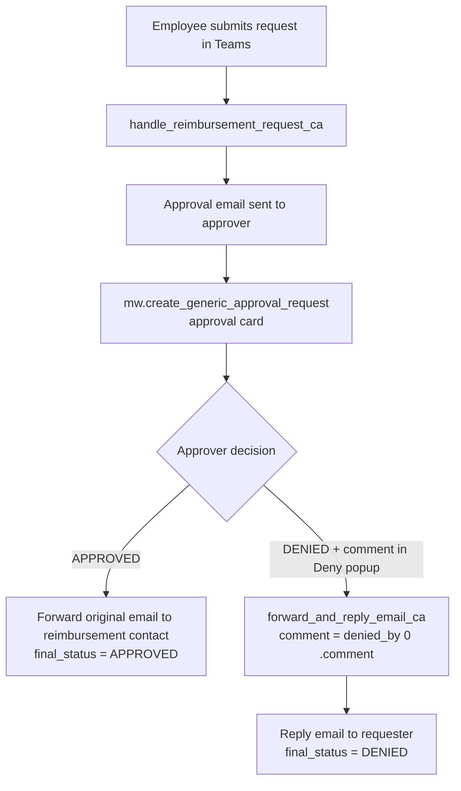
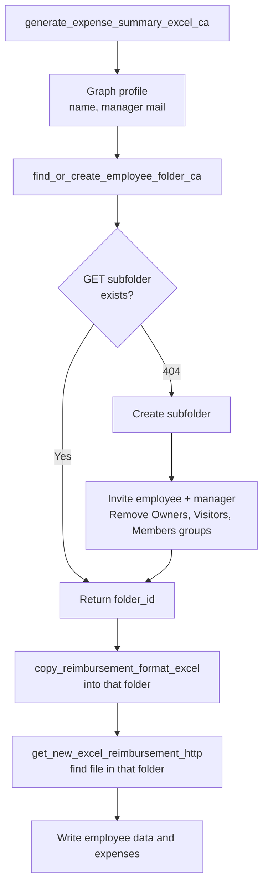

# Reimbursement Request: Deny Comment Handling and Employee Folder Access

Handover document for the Moveworks reimbursement use case (UC-09). It covers two pieces of work:

- **Part A:** how a manager's "Deny" comment reaches the employee by email.
- **Part B:** how each employee's reimbursement Excel is stored in a private SharePoint folder that only they and their manager can open.

Everything here was built in **Moveworks Tool Studio** (Agent Studio). Sections marked **Status** say what was tested and what is still open. Read Part D before you rely on any of this in production.

---

## 1. Quick summary

| Topic | Before | After |
|---|---|---|
| Deny comment | The manager typed a reason in the native "Deny" popup, and it was thrown away. A second chat prompt asked again, and the email went to the wrong person. | The popup comment is read from the approval result and emailed to the employee. The second prompt is gone. |
| Reply email recipient | A hardcoded external test address was used in the forward step. | The reply goes to the requester (`user_email`). |
| Excel storage | Every employee's Excel sat in one shared folder visible to everyone in the SharePoint site. | Each employee gets a subfolder. Access is limited to the employee, their manager and the site Owners. |

---

## 2. Assets and where they live

All of these are in Tool Studio.

| Asset | Type | Role |
|---|---|---|
| `cprime_submit_reimbursement_request` | Conversational process | Collects the request in Teams and calls `handle_reimbursement_request_ca`. |
| `handle_reimbursement_request_ca` | Compound action | Sends the approval email, creates the approval card, and handles approve and deny. |
| `forward_and_reply_email_ca` | Compound action | Builds and sends the "declined" reply from the manager's mailbox. |
| `collect_denial_comment` | Conversational process | Old chat prompt for the deny comment. **No longer called**, left in place. |
| `generate_expense_summary_excel_ca` | Compound action | Extracts expenses with AI, then creates and fills the Excel in SharePoint. |
| `find_or_create_employee_folder_ca` | Compound action (new) | Finds or creates the employee's private folder and locks its permissions. |
| `get_employee_folder_http` | HTTP action (new) | Looks up a subfolder by name. |
| `create_employee_folder_http` | HTTP action (new) | Creates a subfolder. |
| `invite_folder_access_http` | HTTP action (new) | Grants employee and manager access. |
| `get_folder_permissions_http` | HTTP action (new) | Lists a folder's permissions (used for verification). |
| `remove_folder_permission_http` | HTTP action (new) | Removes one permission entry. |
| `copy_reimbursement_format_excel` | HTTP action (changed) | Copies the Excel template. The destination folder is now an input. |
| `get_new_excel_reimbursement_http` | HTTP action (changed) | Finds the copied file by name inside the employee's folder. |

All the SharePoint and Outlook calls use the connector `ms_graph_files_connector` (base URL `https://graph.microsoft.com/v1.0`).

---

# Part A. Deny comment handling

## A1. The problem

When a manager clicks **Deny** on the approval card, Teams shows a native "Deny" popup with a **User Comment** field. Three things were wrong:

1. The comment typed in the popup was never used by the flow.
2. The `DENIED` branch sent a **second** chat message ("Click the button below and provide a comment...") and started the `collect_denial_comment` process. Only the comment typed there reached the email.
3. The reply email was addressed to the wrong person.

## A2. Root causes found

| # | Finding | Evidence |
|---|---|---|
| 1 | The `DENIED` branch never read the approval result's comment. | The `DENIED` case only checked `status` and started the chat prompt. |
| 2 | The Available Data panel shows only `current_approvers`, `status` and `state` for the approval result, so the comment looked unavailable. | Moveworks' built-in action documentation shows the denied response includes `denied_by[]`, each with a `comment`. The field exists but the editor's schema browser does not list it. |
| 3 | The recipient was wrong. `user_email` was mapped to the approver's email, and inside `forward_and_reply_email_ca` the `create_draft_forward_http` step had a **hardcoded** `to_recipients` (an external test address) instead of using the `user_email` input. | Seen in the action's data mapper. Replaced with `data.user_email`. |

The "Deny with Comment" button is controlled in Moveworks Setup under Approval Settings (integration level or global). It was already on.

## A3. Final design



The chat prompt and the `collect_denial_comment` hand-off are removed from this path.

## A4. `handle_reimbursement_request_ca`, DENIED case

```yaml
- condition: data.manager_approval.status == "DENIED"
  steps:
    - action:
        action_name: forward_and_reply_email_ca
        output_key: denial_reply
        input_args:
          ccRecipients: data.ccRecipients
          comment: data.manager_approval.denied_by[0].comment
          manager_email_id: data.manager_email.value[0].id
          submitted_user: meta_info.user.first_name
          user_email: meta_info.user.email_addr
    - return:
        output_mapper:
          final_status: "'DENIED'"
```

Field meanings:

| Input | Source | Meaning |
|---|---|---|
| `comment` | `data.manager_approval.denied_by[0].comment` | The text from the Deny popup. |
| `user_email` | `meta_info.user.email_addr` | The requester. The reply is sent **to** this address. |
| `ccRecipients` | `data.ccRecipients` | Cc list from the original request. It must be an **array**. |
| `manager_email_id` | `data.manager_email.value[0].id` | Graph message ID of the approval email. The reply is created as a forward of that message. |
| `submitted_user` | `meta_info.user.first_name` | Used in the greeting of the email. |

A mistake to avoid: an early version of this block had `comment` and `ccRecipients` swapped (comment mapped to the cc list, cc mapped to the requester's email). Check both lines if the email shows an email address as the reason.

## A5. What `forward_and_reply_email_ca` does

Inputs: `comment`, `manager_email_id`, `ccRecipients` (array), `user_email`, `submitted_user`.

| Step | Action | Purpose |
|---|---|---|
| 1 | `mw.get_user_by_email` (`approver_user`) | Resolves the user record from `user_email`. |
| 2 | `msgraph_get_user_profile_http` (`approver_msgraph`) | Gets department, job title and manager for the email signature. |
| 3 | `format_reply_for_reimbursement_email_script` (`formatted_reply`) | Builds the HTML body. `emailContent` is `$CONCAT(["Your reimbursement request has been <strong>declined</strong> for the following reason:<br>", data.comment], " ")`. This step does not add any text of its own to the comment. |
| 4 | `create_draft_forward_http` (`forward_draft`) | Creates a forward of the approval email with the HTML body, to `user_email`, cc `ccRecipients`. |
| 5 | `send_draft_outlook_mail_http` | Sends it. |

## A6. The "via @MSTeams_AI_Bot" suffix

Teams appends " via @MSTeams_AI_Bot" to the comment. It comes from `denied_by[0].comment` itself, not from the email template.

Cleanup, applied in the `comment` mapping:

```yaml
comment: data.manager_approval.denied_by[0].comment.$REPLACE("\.?\s*via @MSTeams_AI_Bot.*", "")
```

The first attempt used the exact string `" via @MSTeams_AI_Bot"` and failed when the comment ended with a period before "via". The regex handles an optional period, extra spaces, or nothing before the tag. `$REPLACE` uses regex (documented in the Moveworks DSL reference).

**Status:** confirmed in an end-to-end test on 2026-10-01. The suffix no longer appears in the reply email.

## A7. Related fixes made along the way

- The requester and approver can be the same person in tests. Do not assume `approver_user` is a different person from `meta_info.user`.
- In `cprime_submit_reimbursement_request`, `toRecipients` is a **string** and `ccRecipients` is an **array**, because `create_draft_outlook_email_http` builds the To list from a single string and maps over the Cc array.
- `create_draft_outlook_email_http` takes `expense_summary` and `attached_files` as **File** inputs, with fields `content` (base64), `file_name` and `location`. The body maps them through the File tab (`files.excel_data`, `files.uploaded_files`). This makes it hard to call with fake values.

## A8. How to test

Standalone **Run** testing has limits.

- Running `handle_reimbursement_request_ca` by hand sends **real emails and a real approval card**.
- Running `forward_and_reply_email_ca` by hand fails at the forward step with `ErrorInvalidIdMalformed` unless `manager_email_id` is a **real Graph message ID**. An email address will not work.

Recommended test, using one real Teams submission:

1. Submit a request in Teams, with the requester and approver being yourself or a test manager.
2. On the approval card, click **Deny**.
3. Type a comment ending in a period, such as `Receipt is missing.`
4. Confirm: no second chat prompt appears, the email arrives in the requester's inbox, the reason matches, and the "via @MSTeams_AI_Bot" tag is gone.
5. Check logs in the Moveworks logs view for the run's `forward_and_reply_email_ca` steps if anything is off.

## A9. Known issues and open items (deny and approval)

- The `toRecipients` value in the process is currently a **hardcoded test address** (the requester themselves). Production should resolve the real manager, for example from the manager's mail in the Graph profile (`data.msgraph_user.manager.mail`).
- The `APPROVED` branch forwards to a **hardcoded** address in `create_draft_forward_http`. Move this to configuration when the finance contact is finalised.
- `collect_denial_comment` and its chat prompt are unused. Delete them after a release or two.

---

# Part B. Private employee folders in SharePoint

## B1. The problem

The generated Excel files were all copied into one folder, `Users Reimbursement Data`, in the "INRY Clients" site. That folder inherits from the site, so every site member could read every employee's reimbursement file, including financial details.

Requirement: **only the employee, their manager and the site administrators can see a given file.**

## B2. Design

Use SharePoint's own permission inheritance instead of changing permissions file by file.



Key points:

- A subfolder is created per employee **once**. Later submissions reuse it.
- Permissions are changed only on the **folder**. Files copied into it inherit them, so no per-file permission calls are needed.
- Folder permissions are set up only when the folder is first created, in the `catch` branch of the `404`.

## B3. Constants

| Name | Value |
|---|---|
| Site | `inryclients` on `cprimetech.sharepoint.com` |
| Library path | `Moveworks Templates/Users Reimbursement Data` |
| `drive_id` | `b!12RaZDWkx0StwI4280Cw6SZ3tR_T1UJHiXKq_p8hYXtow06XtTxURK5si83ugsuo` |
| `parent_id` (the "Users Reimbursement Data" folder) | `01KOPJDH2GRVBQCBED5BALAMLAF7XSYYZB` |
| `site_id` (used by the Excel write actions) | `cprimetech.sharepoint.com,645a64d7-a435-44c7-adc0-8e36f340b0e9,1fb57726-d5d3-4742-8972-aafe9f21617b` |

Permission entry IDs on a new subfolder. These are the base64 of the group name and are the same for every new folder:

| Permission ID | Group | Role | Action |
|---|---|---|---|
| `SU5SWSBDbGllbnRzIE93bmVycw` | INRY Clients Owners (site group) | owner | Remove |
| `SU5SWSBDbGllbnRzIFZpc2l0b3Jz` | INRY Clients Visitors | read | Remove |
| `SU5SWSBDbGllbnRzIE1lbWJlcnM` | INRY Clients Members | write | Remove |
| `Yzowby5jfGZlZGVyYXRlZGRpcmVjdG9yeWNsYWltcHJvdmlkZXJ8OGUzMDdlZDQtODJhZC00YzIyLTkwYTMtYzEzN2NlYjQyMGY3X28` | INRY Clients Owners (Entra/AAD group) | owner | **Not removed** (see B8) |

## B4. The HTTP actions

All use connector `ms_graph_files_connector`. All string variables use **triple braces** (`{{{name}}}`), which avoids HTML escaping in Mustache.

| Action | Method and URL | Body | Inputs (all string, required) |
|---|---|---|---|
| `get_employee_folder_http` | `GET /drives/{{{drive_id}}}/items/{{{parent_id}}}:/{{{folder_name}}}` | none | `drive_id`, `parent_id`, `folder_name` |
| `create_employee_folder_http` | `POST /drives/{{{drive_id}}}/items/{{{parent_id}}}/children` | `{"name": "{{{folder_name}}}", "folder": {}, "@microsoft.graph.conflictBehavior": "fail"}` | `drive_id`, `parent_id`, `folder_name` |
| `invite_folder_access_http` | `POST /drives/{{{drive_id}}}/items/{{{item_id}}}/invite` | `{"requireSignIn": true, "sendInvitation": false, "roles": ["write"], "recipients": [{"email": "{{{employee_email}}}"}, {"email": "{{{manager_email}}}"}]}` | `drive_id`, `item_id`, `employee_email`, `manager_email` |
| `get_folder_permissions_http` | `GET /drives/{{{drive_id}}}/items/{{{item_id}}}/permissions` | none | `drive_id`, `item_id` |
| `remove_folder_permission_http` | `DELETE /drives/{{{drive_id}}}/items/{{{item_id}}}/permissions/{{{permission_id}}}` | none | `drive_id`, `item_id`, `permission_id` |

Behaviours worth knowing:

- Looking up a missing folder returns **404 itemNotFound**. This is expected and drives the try/catch.
- A successful delete returns **204 No Content**. Tool Studio shows "No data". That is success, not an error. Verify by listing permissions.
- Using the same email for `employee_email` and `manager_email` produces one merged entry.
- The invite uses `sendInvitation: false`, so no email goes to the invited people.

## B5. `find_or_create_employee_folder_ca`

Inputs (string, required): `drive_id`, `parent_id`, `folder_name`, `employee_email`, `manager_email`. Returns `folder_id`.

```yaml
steps:
  - try_catch:
      try:
        steps:
          - action:
              action_name: get_employee_folder_http
              output_key: existing_folder
              input_args:
                drive_id: data.drive_id
                folder_name: data.folder_name
                parent_id: data.parent_id
      catch:
        on_status_code:
          - 404
        steps:
          - action:
              action_name: create_employee_folder_http
              output_key: created_folder
              input_args:
                drive_id: data.drive_id
                folder_name: data.folder_name
                parent_id: data.parent_id
          - action:
              action_name: invite_folder_access_http
              output_key: invite_result
              input_args:
                drive_id: data.drive_id
                item_id: data.created_folder.id
                employee_email: data.employee_email
                manager_email: data.manager_email
          - action:
              action_name: remove_folder_permission_http
              output_key: removed_owners_group
              input_args:
                drive_id: data.drive_id
                item_id: data.created_folder.id
                permission_id: "'SU5SWSBDbGllbnRzIE93bmVycw'"
          - action:
              action_name: remove_folder_permission_http
              output_key: removed_visitors_group
              input_args:
                drive_id: data.drive_id
                item_id: data.created_folder.id
                permission_id: "'SU5SWSBDbGllbnRzIFZpc2l0b3Jz'"
          - action:
              action_name: remove_folder_permission_http
              output_key: removed_members_group
              input_args:
                drive_id: data.drive_id
                item_id: data.created_folder.id
                permission_id: "'SU5SWSBDbGllbnRzIE1lbWJlcnM'"
  - return:
      output_mapper:
        folder_id:
          COALESCE():
            items:
              - data.existing_folder.id
              - data.created_folder.id
```

How it works:

- The lookup runs first. If the folder exists, `existing_folder.id` is returned.
- If the lookup returns 404, the `catch` runs: create, invite, then remove the three broad groups. `created_folder.id` is returned.
- `COALESCE()` returns whichever of the two IDs exists.
- `on_status_code` must sit **inside** `catch`, at the same level as `steps`. Putting it elsewhere makes the visual editor report `Unknown step type in pro code: {"try_catch:steps":null}`.

### Naming the folder

The folder name must be unique per person. Display names can collide and can contain characters that cause trouble, so use the employee's **email address**:

```yaml
folder_name: meta_info.user.email_addr
```

The first wiring used the display name with spaces replaced (`data.msgraph_profile.displayName.$REPLACE(" ", "_")`). The email is the recommended value. Apply it and publish.

## B6. Changes to existing actions

### `generate_expense_summary_excel_ca`

New step after `msgraph_get_user_profile_http` and before the copy:

```yaml
- action:
    action_name: find_or_create_employee_folder_ca
    output_key: employee_folder
    input_args:
      drive_id: "'b!12RaZDWkx0StwI4280Cw6SZ3tR_T1UJHiXKq_p8hYXtow06XtTxURK5si83ugsuo'"
      employee_email: meta_info.user.email_addr
      folder_name: meta_info.user.email_addr
      manager_email: data.msgraph_profile.manager.mail
      parent_id: "'01KOPJDH2GRVBQCBED5BALAMLAF7XSYYZB'"
```

The copy and lookup steps now receive the folder:

```yaml
- action:
    action_name: copy_reimbursement_format_excel
    output_key: copy_status
    input_args:
      destination_folder_id: data.employee_folder.folder_id
      timestamp_file_name: data.fileName
- action:
    action_name: get_new_excel_reimbursement_http
    output_key: copied_file
    input_args:
      folder_id: data.employee_folder.folder_id
      timestamp_filename: data.fileName
    delay_config:
      seconds: "5"
```

Name mapping for the folder ID: Graph returns it as `id`; the invite and remove actions take it as `item_id`; `find_or_create_employee_folder_ca` returns it as `folder_id`; the copy action takes it as `destination_folder_id`. From the caller's side it is always `data.employee_folder.folder_id`.

### `copy_reimbursement_format_excel`

New input `destination_folder_id` (string, required). Body:

```json
{
  "parentReference": {
    "driveId": "b!12RaZDWkx0StwI4280Cw6SZ3tR_T1UJHiXKq_p8hYXtow06XtTxURK5si83ugsuo",
    "id": "{{{destination_folder_id}}}"
  },
  "name": "{{{timestamp_file_name}}}"
}
```

The URL (the template file's ID with `/copy`) is unchanged. The copy API is **asynchronous**: it replies `202 Accepted` with no body, so the flow waits before the lookup.

### `get_new_excel_reimbursement_http`

The old URL looked for the file directly inside the shared folder:

```
/sites/<site>/drive/root:/Moveworks%20Templates/Users%20Reimbursement%20Data//{{timestamp_filename}}
```

That would miss files now in subfolders. New URL, with a second input `folder_id` (string, required):

```
/drives/b!12RaZDWkx0StwI4280Cw6SZ3tR_T1UJHiXKq_p8hYXtow06XtTxURK5si83ugsuo/items/{{{folder_id}}}:/{{{timestamp_filename}}}
```

It returns the file's `id` at the top level, so the later steps (`data.copied_file.id`) need no change.

## B7. Resulting access

| Who | Access to an employee folder |
|---|---|
| The employee | write (via invite) |
| The employee's manager | write (via invite) |
| Site Owners (Entra/AAD group "INRY Clients Owners") | owner (not removable, see B8) |
| Other site members and visitors | none |

The Moveworks connector still works because it is an app identity, not one of the removed groups.

If the manager should only read, change `"roles": ["write"]` to `["read"]` in `invite_folder_access_http`. That also applies to the employee unless you split the call.

## B8. Verification evidence

Tested on a throwaway folder before wiring into the compound action.

| Test | Result |
|---|---|
| Lookup of a folder that does not exist | 404 `itemNotFound` (expected). |
| Create folder | 201, new folder under `Users Reimbursement Data`. |
| `find_or_create_employee_folder_ca`, first run | Created the folder and returned `folder_id`. |
| Same compound action, second run, same name | Used the lookup only, returned the **same** `folder_id`, created nothing. |
| Invite | 200, one `write` entry created for the email. |
| List permissions on the new folder | Initially five entries: three site groups (Owners, Visitors, Members), the invited user and the Entra/AAD Owners group. |
| Remove Visitors | Gone from the list (204, "No data"). |
| Remove Owners and Members | Gone from the list. |
| Final list | The invited user and the Entra/AAD Owners group. |

An end-to-end run through the full flow was then done on 2026-10-01 (new submission, folder creation, permission lockdown, copy, lookup, Excel fill, and a denial with the reply email). It worked as expected.

The Entra/AAD Owners entry was not removed. The reason was not confirmed. It most likely represents the Microsoft 365 group owners behind the site and cannot be changed at item level. These are the site administrators, so this is considered acceptable.

## B9. Limitations and risks

1. **Partial failure.** The lockdown steps run only when the folder is first created. If a run fails after the folder is created but before the permissions are removed, the next run finds the folder and skips the lockdown, leaving it open. Check permissions on any folder created during a failed run. A fix would be to run the lockdown steps every time, which is safe because they are idempotent apart from deletes of already-removed entries returning an error.
2. **Employees with no manager.** `data.msgraph_profile.manager.mail` may be empty. Not tested.
3. **Email changes.** If someone's email changes they get a new folder. The old folder stays locked to them.
4. **Who else needs access.** Finance or anyone who opens these files from SharePoint, not from the email attachment, no longer has access unless they are site Owners.
5. **Existing files.** About 69 files created before this change are still loose in `Users Reimbursement Data` and **still visible to everyone**. See B10.
6. **Manager entry not tested separately.** The earlier tests used the same email for employee and manager. Test once with two different emails.

## B10. Remaining work

- **Clean up the old files.** For each employee: create their subfolder, move their files into it, and apply the same permissions. Doing this by hand in SharePoint ("Manage access") is workable for a one-time job. The actions built here can also be reused for a one-off script.
- Delete test folders such as `Test_Folder_123` and `Test_Folder_456`.

---

# Part C. Operations runbook

## C1. Check who can open a folder

Run `get_folder_permissions_http` with the folder's `drive_id` and its `item_id` (the folder ID). Expect the employee, the manager and the Entra/AAD Owners group. Or in SharePoint: select the folder, then **Manage access**.

## C2. Give someone access

Run `invite_folder_access_http` with the folder ID and the person's email in `employee_email` (set `manager_email` to the same address or a second person).

## C3. Remove someone or a group

Run `get_folder_permissions_http` to find the permission's `id`, then `remove_folder_permission_http` with that ID. A 204 with no body means success.

## C4. Redo a lockdown manually

1. List permissions on the folder.
2. Remove any site group entries (Owners, Visitors, Members) using the IDs in B3.
3. Invite the employee and manager.

## C5. Troubleshooting

| Symptom | Cause and fix |
|---|---|
| Testing an HTTP action returns 400 `invalidRequest` | The input args have no **example values**, so the URL was built with empty strings. Add examples in Input Args. |
| 400 "drive ID is incorrectly formatted" | `drive_id` example has a typo, a missing `b!`, spaces or quotes. |
| Remove or delete shows "No data" | Normal for 204. Check with `get_folder_permissions_http`. |
| `ErrorInvalidIdMalformed` on the forward | `manager_email_id` is not a real Graph message ID. |
| Visual editor says `Unknown step type in pro code` | Indentation in `try_catch`. `on_status_code` goes inside `catch`. |
| Compound action Run does not ask for inputs | A duplicated action lost its Input Args. Re-add them and match the types (arrays versus strings). |
| Request fails to build, no HTTP log line | A required input is missing or has the wrong type (for example a File input given a plain value). |
| Excel step fails with 404 after the copy | The lookup is pointing at the wrong folder, or the copy has not finished. Check B6 and raise the delay. |

---

# Part D. Status checklist

| Item | State |
|---|---|
| Deny comment read from `denied_by[0].comment` and emailed | Working in testing. |
| Reply goes to the requester, not a hardcoded address | Fixed. |
| Suffix removal regex | Confirmed in end-to-end test (2026-10-01). |
| Manager lookup instead of the test address in `toRecipients` | **Open.** |
| The five folder HTTP actions | Built and tested. |
| `find_or_create_employee_folder_ca` get, create and idempotent behaviour | Tested. |
| Permission lockdown inside the `catch` branch | Confirmed in end-to-end test (2026-10-01). |
| `copy_reimbursement_format_excel` takes `destination_folder_id` | Confirmed in end-to-end test. |
| `get_new_excel_reimbursement_http` uses `folder_id` | Confirmed in end-to-end test. |
| Folder name set to the employee's email | Confirmed in end-to-end test. |
| One real Teams submission, folder and permissions checked | Done (2026-10-01). |
| Employee with no manager, and employee and manager as two different people | Not specifically tested. |
| Old files moved into private folders | **Not done.** |

---

# Appendix. Lessons about Tool Studio

- Use `{{{var}}}` for strings in HTTP actions. Use `{{var}}` only for numbers and booleans.
- To test an HTTP action, give every input an example value in Input Args.
- `try_catch` exposes no error body, only the status code, so branch on `on_status_code`.
- A duplicated compound action loses its Input Args.
- The Available Data browser does not always list every runtime field, so check the built-in action reference as well.
- Compound action logs can be read in the Moveworks logs view. The Console tab only shows runs started with Run.
- The DSL Playground (not the Setup, Connectors "API Playground") is the place to test expressions such as `$REPLACE`.
