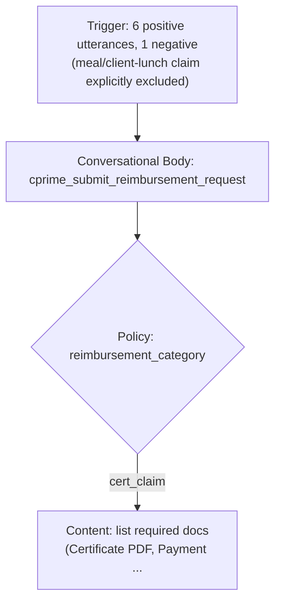

# Recovered Chat History — Reimbursement Request Use Case
Recovered from local Copilot session `b8bfc7c4-eef5-476e-ba1b-13ff1f5a0f6f` (branch `Reimbursement_request`), spanning 2026-09-24 to 2026-09-28.
Assistant replies are truncated to ~1000 characters per message (a limit of the local session store), but all turns are captured below in order.

---

## Turn 1 — 2026-09-24 06:09
**You:** i have cretaed another branch handling diferent case like for reimbursement request . but it comes with all th file in the main nwhy?

**Assistant:** That's normal Git behavior — a new branch is just a pointer to a commit, so it starts out identical to whatever branch you created it from. Looking at your history: `Reimbursement_request` currently points to the same commit (`8bf4f15`) as `main` — meaning it was branched off `main` after all those files were already committed there. So it inherits everything. Compare that to `Bfs_problem`, `Train_problem`, `Moveworks_portal`, `fresh_start` — those all branched from a separate `Initial empty branch` (`b57090e`) commit, which is why they only contain their own...

---

## Turn 2 — 2026-09-24 06:11
**You:** if i delete any file in the branch it will refelect i mean the files are deleted in the main bran a well ah?

**Assistant:** You're currently on `Reimbursement_request`. So if you do this:
```powershell
git rm some_unrelated_file.py
git commit -m "Remove unrelated file from Reimbursement_request branch"
git push
```
- ✅ deleted only on `Reimbursement_request` (and its remote after push).
- ✅ `main` still has that file, untouched. The only way a deletion would touch `main` is if you later merge `Reimbursement_request` into `main` (and the deletion isn't...

---

## Turn 3 — 2026-09-24 06:15
**You:** then i want to remove all the files except the Reimbursement_Request_in_chat.html,README.md from my reimburement_ request branch only.

**Assistant:** Done. `Reimbursement_request` now contains only `.gitignore`, `README.md`, and `Reimbursement_Request_in_chat.html`, pushed to `origin/Reimbursement_request`. `main` still has all the original files, untouched.

---

## Turn 4 — 2026-09-24 06:18
**You:** i mistakenly delete my .env file pls revert it back

**Assistant:** `.env` was never tracked by Git (it's listed in `.gitignore`), so there's no commit history to restore it from — deleting it isn't recoverable through `git checkout` or `git revert`. Options: 1) **Recycle Bin** if deleted via Explorer. 2) **VS Code Local History** — right-click the folder → check if `.env` shows up, or Command Palette → "Local History: Compare/Restor...

---

## Turn 5 — 2026-09-24 06:24
**You:** i need my .env file back pls get bacck.i accidentaly dete that now

**Assistant:** `.env` is restored to `c:\Users\KayathriRengasamy\Moveworks_Jira\.env` from VS Code's local history (last saved snapshot). It's still listed in `.gitignore`, so it won't be tracked by Git going forward — worth keeping a secure backup of these credentials somewhere (password manager) in case this happens again, since Git can't help recover it next time.

---

## Turn 6 — 2026-09-24 06:27
**You:** they have assignt this reimburesement usecase work to me. but actually anothe person is worked in tha part no they are busy and i got this work. i have work on that / i only have this opened html file. can you explain me what the usecase is about. what we need to everything explain cleary i think you know how to explain to me

**Assistant:** Here's the breakdown of what this file describes — the **"Reimbursement Request in Chat"** use case (labeled `UC-09 · Employee Experience` in the doc).

**The Big Picture**
Problem it solves: Today, when an employee needs to get reimbursed for something they paid out of pocket (client dinner, travel, supplies), they usually have to open an expense portal, fill in a multi-field form, upload a receipt, and wait — often chasing their manager or finance separately for status.
What this use case does: Lets the employee do the entire thing by just chatting in Micro...

---

## Turn 7 — 2026-09-24 07:11
**You:** here dont include the projector scripts this is diffrenr usecase we handle diffrently think

**Assistant:** Got it — noting that the Projector PSA scripts are unrelated; this reimbursement flow is handled through a separate integration (makes sense why the branch is now clean with just the HTML + README). One thing I noticed in the file's CSS: the finance layer is internally classed `layer-workday` (`<div class="layer layer-workday">`), even though the label displayed says "Finance." That might just be a leftover from a template, or it could hint the actual backend is **Workday** rather than Projector. Do you know what system this reimbursement flow actually integrates with...

---

## Turn 8 — 2026-09-24 07:13
**You:** git ve me steps how do to achieve this use case from the scranch

**Assistant:** Here's a practical build roadmap for this use case, structured the way you'd actually build it in **Moveworks Creator Studio** (or your Agent Studio / plugin builder), from zero to production.

**Phase 0 — Scope & Requirements (before touching any tool)**
1. Confirm the finance backend system (Workday, Projector, SAP, etc.) and get API/connector credentials + a sandbox environment.
2. Confirm manager lookup source — HRIS/Workday/Azure AD — so Moveworks can resolve "employee → manager → cost center."
3. Get the reimbursement policy rules in writing (max amount...

---

## Turn 9 — 2026-09-25 07:50
**You:** C:\Users\KayathriRengasamy\Moveworks_Jira\Reimbursement_request_V2.html. this the new version can you pls give me the full details of the explained usecase and step to do that

**Assistant:** This V2 version simplifies things significantly compared to V1 — no policy-check branch, and finance is **handed off manually** (via a generated Excel sheet) rather than integrated via an automated payment API. That matches what you said earlier about handling this "differently."

**What Changed from V1 → V2**

| | V1 | V2 |
|---|---|---|
| Policy check decision | ✅ Yes (within-policy vs exceeds) | ❌ Removed |
| Excel report generation | ❌ Not present | ✅ New step — auto-generates org-format Excel from receipt |
| Finance integration | Automated API record creation + pay...

---

## Turn 10 — 2026-09-28 06:33
**You:** i have fiven all the details of this usecase how much this one is developed till now from this please explain clealy in evry step erythin and what and it will do how the flow is and how much it is completed what should i do next evrything give me me ans tell me in a clear picture

**Assistant:** Based on the screenshots, here's the exact current state of your `cprime_submit_reimbursement_request` plugin (V270, Published) in Tool Studio — a full breakdown of what's built, what it does, and what's left.

**1. What's Actually Built (node-by-node)**

*(diagram truncated — re-open the plugin in Tool Studio to see the live version)*

---

## Turn 11 — 2026-09-28 08:12
**You:** [Pasted a call transcript with Sai Venkat Yanamandra discussing the reimbursement use case — included live Microsoft auth tokens in image URLs]

**Assistant:** ⚠️ **Security note:** That transcript had live Microsoft auth tokens (JWTs) embedded in the persona-photo image URLs for you and Sai. These are bearer tokens tied to your account session (Files.Read, User.Read scopes). Avoid pasting transcripts like this into files, tickets, or repos going forward — treat them like passwords.

Content pulled from the transcript: both the real-world process Sai explained, and action items for you to follow up on.

---

## Turn 12 — 2026-09-28 08:21
**You:** C:\Users\KayathriRengasamy\Moveworks_Jira\Reimbursement_request_V2.html the current one is sai sent to me.

**Assistant:** This file is identical to the version already reviewed earlier — no changes were made compared to what was discussed before your call with Sai. Useful to flag: this HTML still doesn't match the real process Sai described on the call, nor the actual Tool Studio build:

| This HTML (steps 07-09) | What Sai described + what's actually built |
|---|---|
| "Manager Notified in Teams" / "Approves or Declines directly in Teams" (In-Chat Decision) | Manager approval actually happens via Outlook email (Outlook Approvals, `final_status` = APPROVE...

---

## Turn 13 — 2026-09-28 08:21
**You:** he is asked me to check witha deny comments what is that tell me excatly

**Assistant:** Nothing in the transcript you shared says "deny comments" explicitly — so can't quote Sai's exact words on that. But based on what's already seen in Tool Studio, here's what it almost certainly refers to:

**What "Deny Comments" Likely Means**
In your `handle_reimbursement_request_ca` action, the manager's approval/decline happens through an **Outlook Approval** (Microsoft's built-in Approvals feature in Outlook/Teams). When a manager clicks Reject/Decline on that approval card, Outlook prompts them with a comment box to type why they're rejecting it...

---
*End of recovered transcript. If you need the full, untruncated assistant replies, VS Code's chat History view still has the original session stored — see instructions below to un-hide it.*
