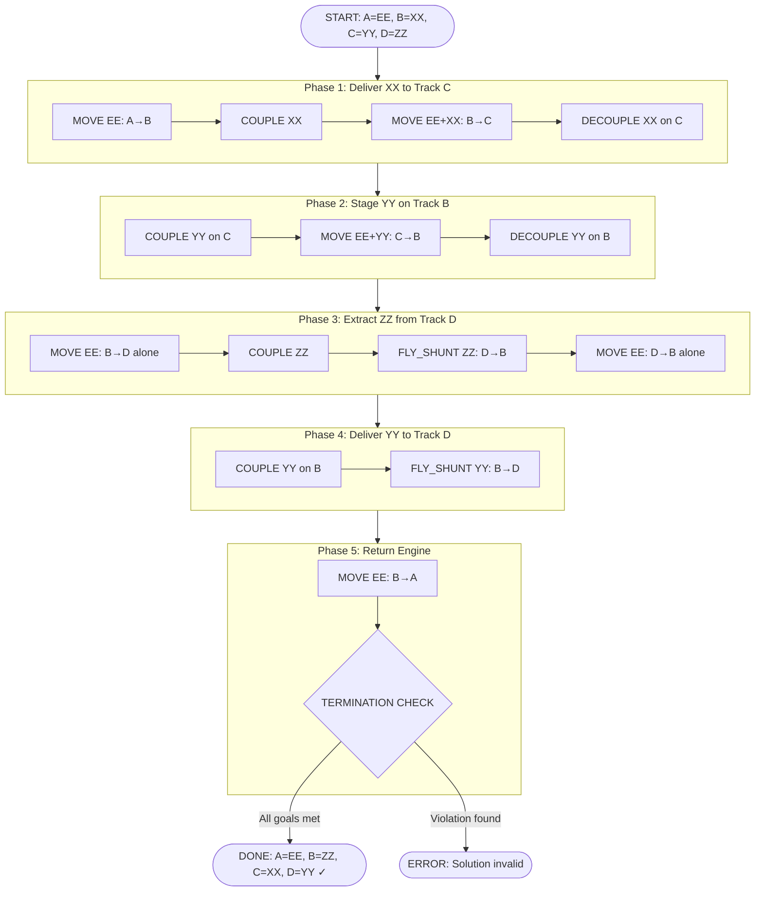
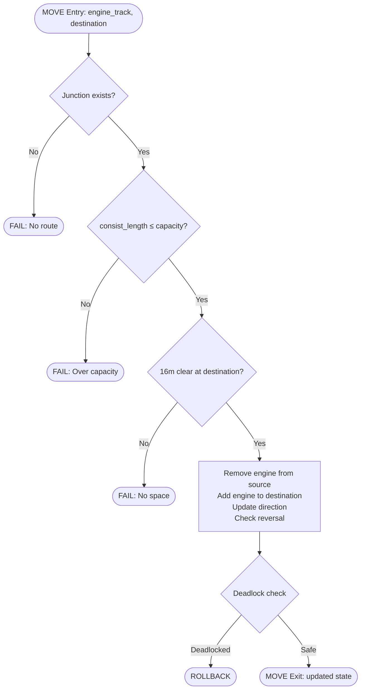
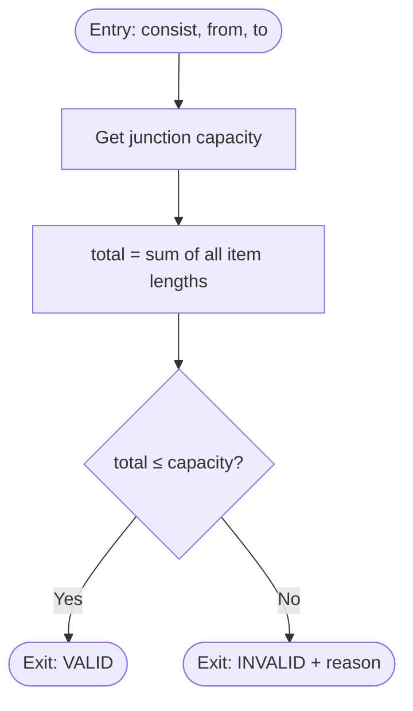
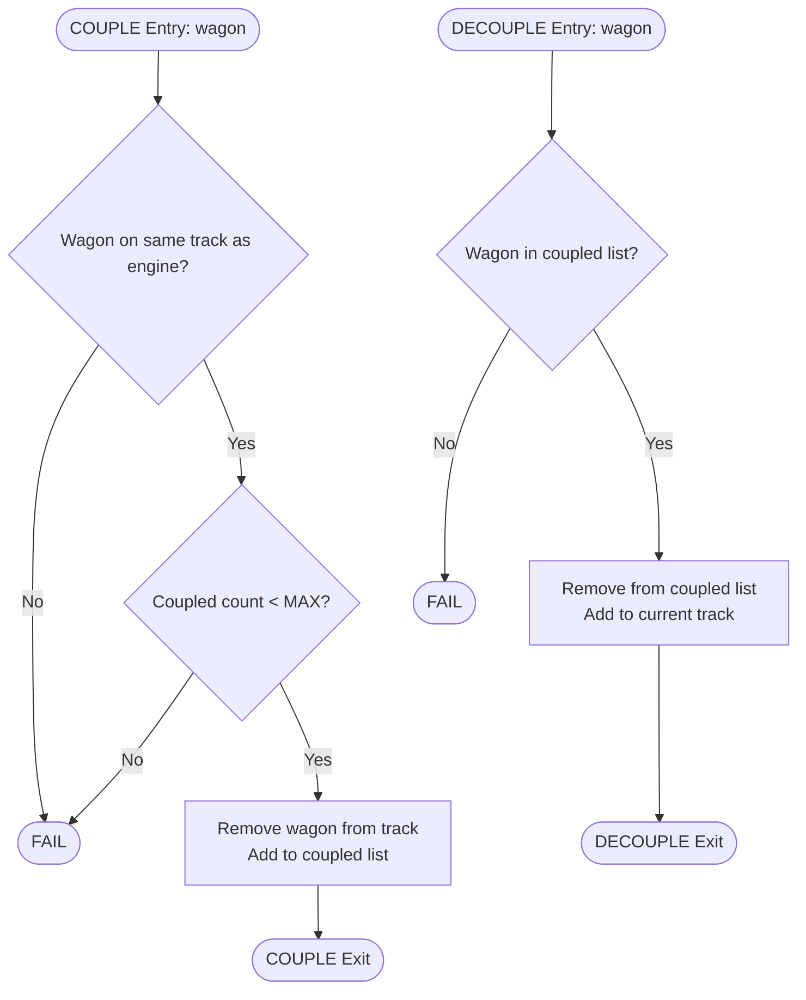
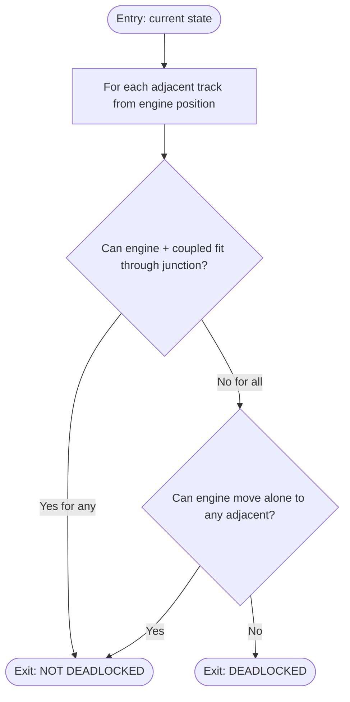
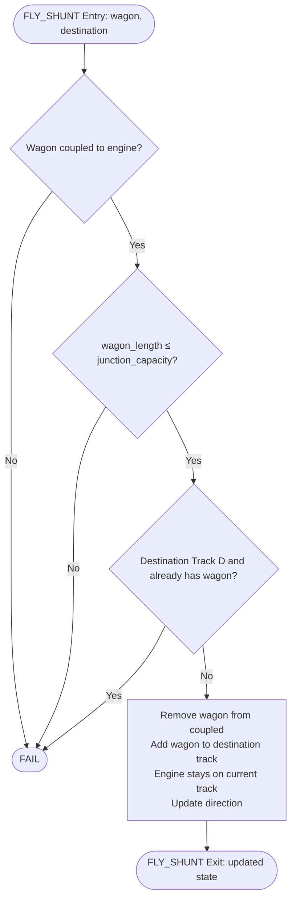

# 2S Triangular Shunting Puzzle — Complete Solution

## 1. Problem Understanding (Real-World Analogy)

Think of this as a **parking lot with narrow one-way exits**:
- Tracks = parking bays (A, B, C form a triangle; D is a dead-end siding off B)
- Junctions = narrow connecting roads with length limits
- Engine = the tow truck (16m long)
- Wagons = cars to rearrange (8m each)

The tow truck can only carry cars through a connecting road if **total length ≤ road capacity**. The dead-end siding (D) has a 16m-long connector — just enough for the tow truck alone, but NOT with any car attached.

**Solution**: "Fly shunting" — push a car at speed, decouple, and let it roll through on its own (only car's 8m counts against the 16m limit).

---

## 2. System Topology

```
         Track A
        /       \
   CA(8m)      AB(24m)
      /           \
 Track C ────── Track B ─── Track D
      BC(∞)         BD(16m)
```

**Movement Rules:**
| Route | Capacity | Engine alone? | Engine + 1 wagon? | Engine + 2 wagons? |
|-------|----------|:---:|:---:|:---:|
| A ↔ B | 24m | ✓ (16m) | ✓ (24m) | ✗ (32m) |
| B ↔ C | ∞ | ✓ | ✓ | ✓ |
| C ↔ A | 8m | ✗ (16m > 8m) | ✗ | ✗ |
| B ↔ D | 16m | ✓ (16m) | ✗ (24m) | ✗ |

**Key Insight**: Engine can NEVER use CA junction. Wagons reach D only via **fly shunting** (8m ≤ 16m).

---

## 3. Master Flowchart



---

## 4. Module Sub-Flowcharts

### 4.1 MOVE Module



### 4.2 VALIDATE_CAPACITY Module



### 4.3 COUPLE / DECOUPLE Module



### 4.4 DEADLOCK_CHECK Module



### 4.5 FLY_SHUNT Module



---

## 5. Step-by-Step Execution (with Input/Output)

| Step | Action | Junction Used | Capacity Check | State After (A, B, C, D) | Coupled |
|------|--------|:---:|:---:|:---:|:---:|
| 0 | Initial | — | — | EE, XX, YY, ZZ | — |
| 1 | MOVE EE: A→B | AB | 16 ≤ 24 ✓ | —, EE+XX, YY, ZZ | — |
| 2 | COUPLE XX | — | 1 ≤ 2 ✓ | —, EE, YY, ZZ | XX |
| 3 | MOVE [EE+XX]: B→C | BC | 24 ≤ ∞ ✓ | —, —, EE+XX+YY, ZZ | XX |
| 4 | DECOUPLE XX on C | — | — | —, —, EE+XX+YY, ZZ | — |
| 5 | COUPLE YY | — | 1 ≤ 2 ✓ | —, —, EE+XX, ZZ | YY |
| 6 | MOVE [EE+YY]: C→B | BC | 24 ≤ ∞ ✓ | —, EE+YY, XX, ZZ | YY |
| 7 | DECOUPLE YY on B | — | — | —, EE+YY, XX, ZZ | — |
| 8 | MOVE EE: B→D | BD | 16 ≤ 16 ✓ | —, YY, XX, EE+ZZ | — |
| 9 | COUPLE ZZ | — | 1 ≤ 2 ✓ | —, YY, XX, EE | ZZ |
| 10 | FLY_SHUNT ZZ: D→B | BD | 8 ≤ 16 ✓ | —, YY+ZZ, XX, EE | — |
| 11 | MOVE EE: D→B | BD | 16 ≤ 16 ✓ | —, EE+YY+ZZ, XX, — | — |
| 12 | COUPLE YY | — | 1 ≤ 2 ✓ | —, EE+ZZ, XX, — | YY |
| 13 | FLY_SHUNT YY: B→D | BD | 8 ≤ 16 ✓ | —, EE+ZZ, XX, YY | — |
| 14 | MOVE EE: B→A | AB | 16 ≤ 24 ✓ | **EE**, **ZZ**, **XX**, **YY** | — |

---

## 6. BFS-Discovered Optimal Solution (12 actions, 2 reversals)

The dynamic BFS solver found an even more streamlined action sequence:

```
 1. MOVE [EE] A→B
 2. COUPLE XX on B
 3. FLY_SHUNT XX B→C (engine stays B)     ← fly-shunt avoids engine going to C
 4. MOVE [EE] B→D
 5. COUPLE ZZ on D
 6. FLY_SHUNT ZZ D→B (engine stays D)
 7. MOVE [EE] D→B
 8. MOVE [EE] B→C
 9. COUPLE YY on C
10. MOVE [EE+YY] C→B
11. FLY_SHUNT YY B→D (engine stays B)
12. MOVE [EE] B→A
```

**Why this is better**: The BFS solution uses fly-shunting for XX (B→C via BC junction, 8m ≤ ∞), avoiding the engine needing to travel to C and back for delivery. This saves 2 moves compared to the manual solution.

---

## 7. Reversal Analysis

| Move | Direction | Reversal? | Reason |
|------|-----------|:---------:|--------|
| A→B | Forward | No | First move |
| B→D | Branch | No | New branch direction |
| D→B | Return | **Yes (1)** | Opposite of B→D |
| B→C | Continue | No | New direction |
| C→B | Return | **Yes (2)** | Opposite of B→C |
| B→D (push) | — | No | Fly shunt, no full transit |
| B→A | Return | No | New direction from B |

**Total: 2 reversals** (BFS optimal). Structurally necessary — impossible to avoid both round-trips.

---

## 8. Deadlock Prevention Strategy

### Potential Deadlock Scenarios:

| Scenario | Risk | Prevention |
|----------|------|------------|
| Engine trapped on D with wagon | EE+wagon (24m) > BD capacity (16m) | **Never exit D with coupled wagon. Always fly-shunt first.** |
| Engine trapped on C | CA (8m) too small for engine | **Always exit C via B (BC is unlimited)** |
| Engine trapped on A | CA unusable, AB only exit | **AB (24m) always allows engine + 1 wagon** |
| Circular dependency | Need to move X before Y before X | **Phased approach: deliver XX first, then handle D exchanges** |

### Design Invariant:
> After every state transition, at least one valid move exists for the engine.

This is enforced by the `DEADLOCK_CHECK` module which runs post-transition.

---

## 9. Constraint Verification Matrix

| # | Constraint | How Verified | Status |
|---|-----------|:---:|:---:|
| 1 | Junction capacity ≤ limit | `VALIDATE_CAPACITY` before every MOVE | ✓ |
| 2 | Engine needs 16m clear | Checked at destination | ✓ |
| 3 | No U-turns at junctions | Direction changes only on tracks | ✓ |
| 4 | Max 2 wagons coupled | `COUPLE` checks count | ✓ |
| 5 | 1 unattended wagon/junction | No junctions used for storage | ✓ |
| 6 | Track D max 1 wagon | `FLY_SHUNT` validates before delivery | ✓ |
| 7 | Capacity validation before moves | Module enforced | ✓ |
| 8 | Deadlock detection | `DEADLOCK_CHECK` post-transition | ✓ |
| 9 | Reversal minimized | BFS finds 2-reversal solution | ✓ |
| 10 | Final state validated | `TERMINATION_CHECK` module | ✓ |

---

## 10. Design Reflection

### 3R Compliance:

**Reusable**: Every module (MOVE, COUPLE, DECOUPLE, FLY_SHUNT, VALIDATE_CAPACITY, DEADLOCK_CHECK, TERMINATION_CHECK) works with any track/wagon/junction configuration. Change the CONFIG dictionary and the system adapts.

**Repeatable**: The BFS solver produces identical results for identical inputs. The modular solver's step sequence is deterministic. No random or order-dependent behavior.

**Replaceable**: Each module has one entry and one exit. You can swap `VALIDATE_CAPACITY` with a different validation logic (e.g., weight-based) without touching MOVE. You can replace BFS with A* or DFS without changing state representation.

### Key Design Decisions:

1. **Fly-shunting as first-class operation**: BD junction (16m) makes direct wagon transfer impossible. Fly-shunting is the structurally necessary mechanism, modeled as a separate validated action.

2. **BFS for optimality**: Breadth-first search guarantees the shortest action sequence. With ~215 nodes explored in 0.01s, the state space is tractable.

3. **Phased decomposition**: The manual solution groups moves into logical phases (deliver XX, stage YY, extract ZZ, deliver YY, return). This makes reasoning about correctness easier and maps to real-world operational planning.

4. **Defensive validation**: Every state transition passes through capacity validation AND deadlock detection before being committed. Invalid states are rejected, never explored further.

---

## 11. File Structure

```
shunting_puzzle/
├── shunting_solver.py      # Modular solution with all 6 required modules
├── dynamic_solver.py       # BFS-based dynamic solver (finds optimal)
├── analysis_report.py      # State table + reversal + deadlock + validation
└── SOLUTION.md             # This document
```

Run: `python shunting_solver.py` for step-by-step execution, `python dynamic_solver.py` for BFS-optimal discovery.
